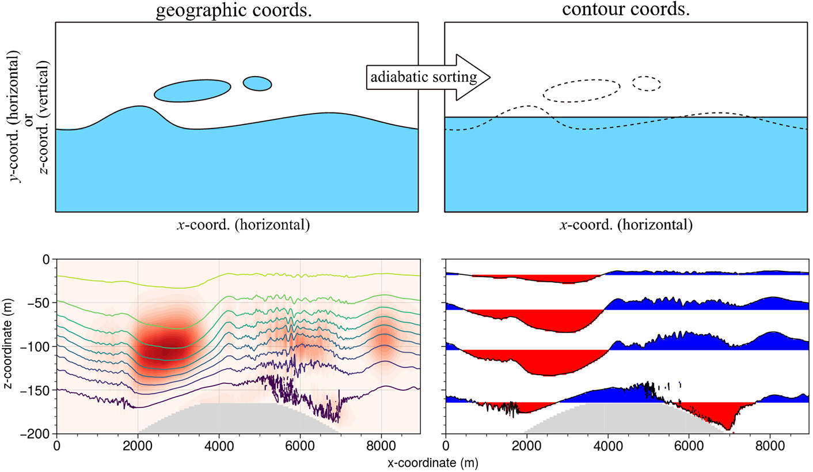
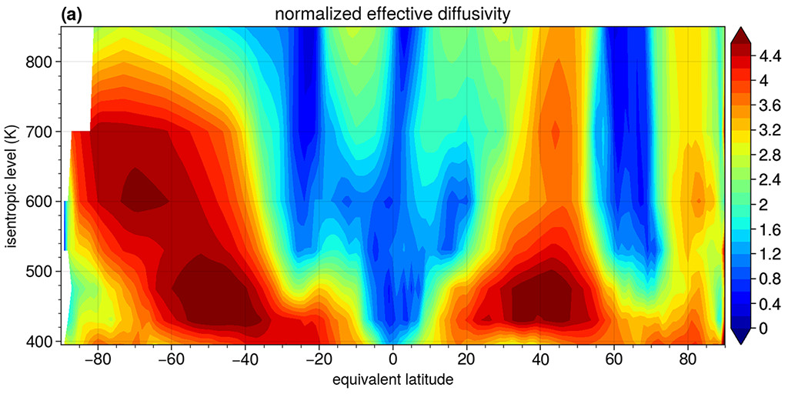
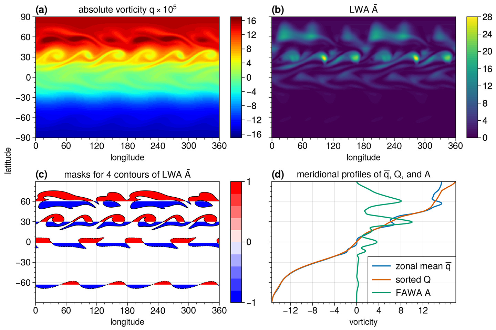
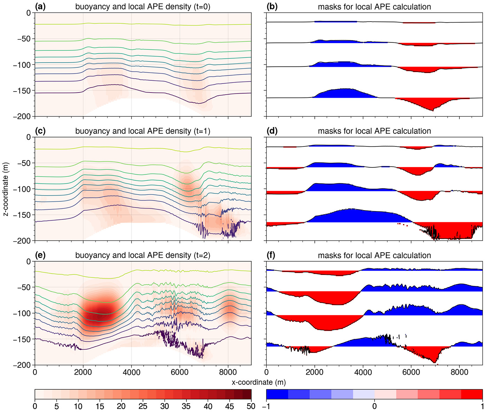
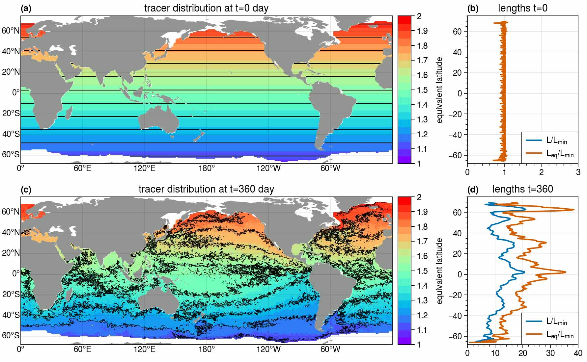

# xcontour

[](https://zenodo.org/badge/latestdoi/473022002)




## 1. Introduction
`xcontour` is a python package built on [`xarray`](http://xarray.pydata.org/en/stable/) (starts with an `x`), targeting at performing diagnostic analyses and calculations in contour-based coordinates.  The new coordinates are built based on iso-surfaces of any quasi-conservative tracers (passive or active), mostly through a conservative rearrangement (or adiabatic sorting in a particular direction).  Such rearrangement allows one to **isolate the adiabatic advective process of a fluid and focus on non-conservative processes**.  Therefore, it simplifies the relavent dynamical view and interpretation of many phenomena.

The most well-known contour-based coordinates are 1) isentropic coordinate used in the atmosphere and 2) isopycnal coordinate used in the ocean, both of which are based on quasi-conservative variables of potential temperature and potential density.  However, traditional coordinate transform requires a one-to-one relation between z-coordinate and isentropic/isopycnal surfaces.  This can not be ensured in nonhydrostatic regions (heavier fluid is laid over lighter fluid).  The adiabatic sorting process used here eliminates such constraint.  For example, after the sorting in the vertical plane, the fluid will be completely stably stratified.

Basically, this package is usually used to accomplish the following tasks:
- calculate an adiabatically-sorted state that is generally a steady-state when diabatic forcings are absent.  The sorted state is also termed as the background state or reference state (e.g., [Nakamura and Solomon 2010, JAS Part I](https://journals.ametsoc.org/view/journals/atsc/67/12/2010jas3503.1.xml), [2011, JAS Part II](https://journals.ametsoc.org/view/journals/atsc/68/11/2011jas3685.1.xml); [Methven and Berrisford 2015, QJRMS]()) .
- calculate effective diffusivity ([Nakamura 1996, JAS](https://journals.ametsoc.org/view/journals/atsc/53/11/1520-0469_1996_053_1524_tdmefa_2_0_co_2.xml)) or dia-scalar diffusivity ([Winters and D'Asaro 1996, JFM](https://www.cambridge.org/core/journals/journal-of-fluid-mechanics/article/diascalar-flux-and-the-rate-of-fluid-mixing/56C6519F711ACAED7FEEAAF9B97BC8ED)) in the contour space;
- calculate (local) wave activity density ([Nakamura 2010, JAS](https://journals.ametsoc.org/view/journals/atsc/67/9/2010jas3432.1.xml); [Huang and Nakamura 2016](https://journals.ametsoc.org/view/journals/atsc/73/1/jas-d-15-0194.1.xml)) or (local) available potential energy density ([Winters and Barkan 2013, JFM](https://www.cambridge.org/core/journals/journal-of-fluid-mechanics/article/available-potential-energy-density-for-boussinesq-fluid-flow/563B240B07CEBFDCD68F77A78FBFED16); [Scotti and White 2014, JFM](https://www.cambridge.org/core/journals/journal-of-fluid-mechanics/article/diagnosing-mixing-in-stratified-turbulent-flows-with-a-locally-defined-available-potential-energy/17223D6D05A72759B2CC64CA85D1175A)) that defined in contour space;
- calculate actual (perimeter) contour length using marching squares algorithm in `scikit-image`;
- calculate any other quantities if relavent...

The calculations mostly take advantages of [`xarray`](http://xarray.pydata.org/en/stable/)'s functionalities rather than writing explicit loops or algorithms, including contour-coordinate expansion, conditional accumulation or integration, coordinate transform and interpolation...  One would see that [`xarray`](http://xarray.pydata.org/en/stable/) **1) supports** multi-dimensional calculations, **2) simplifies** a great deal of work in programming the very details, and **3) applies** to different cases in a unified fashion.

---

## 2. How to install
**Requirements**
`xcontour` is developed under the environment with `numpy` (=version 1.15.4), `xarray` (=version 0.15.1), `xgcm`(=version 0.5.2), and `xhistogram`(=version 0.3.0).  Older versions of these packages are not well tested.


**Install from github**
```
git clone https://github.com/miniufo/xcontour.git
```

---

## 3. Examples
### 3.1 calculate effective diffusivity in the atmosphere


Here is a complete [notebook example on Nakamura's effective diffusivity](./notebooks/1.Keff_atmos.ipynb).

### 3.2 calculate local wave activiy in the atmosphere


Here is a complete [notebook example on local wave activity](./notebooks/2.LWA_atmos.ipynb).

### 3.3 calculate local APE density in the ocean


Here is a complete [notebook example on local APE](./notebooks/3.LAPE_ocean.ipynb).

### 3.4 calculate tracer contour length in the ocean


Here is a complete [notebook example on contour length](./notebooks/4.ContourLength_ocean.ipynb).
